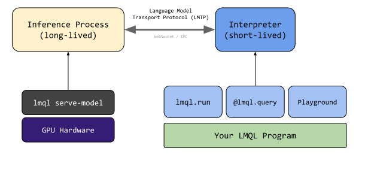

# Local Models / 🤗 Transformers

LMQL relies on a two-process architecture: The inference process (long-running) loads the model and provides an inference API, and the interpreter process (short-lived) executes your LMQL program. This architecture is advantageous for locally-hosted models as the model loading time can be quite long or the required GPU hardware might not be available on the client machine. This chapter first discusses how to use of the two-process inference API, and then presents an alternative on how to leverage [In-Process Model Loading](#in-process-model-loading), which avoids the need for a separate `lmql serve-model` call.



**Prerequisites** Before using the local models, make sure you installed LMQL via `pip install lmql[hf]`. This ensures the dependencies for running local models are installed.

Then, to start an LMQL inference process, e.g. for the `gpt2-medium` model, you can run the following command:

```bash
lmql serve-model gpt2-medium --cuda
```

> `--cuda` will load the model on the GPU, if available. If multiple GPUs are available, the model will be distributed across all GPUs. To run with CPU inference, omit the `--cuda` flag. If you only want to use a specific GPU, you can specify the `CUDA_VISIBLE_DEVICES` environment variable, e.g. `CUDA_VISIBLE_DEVICES=0 lmql serve-model gpt2-medium`.

By default, this exposes the LMQL inference API on port 8080. When serving a model remotely, make sure to tunnel/forward the port to your client machine. Now, when executing an LMQL query in the playground or via the CLI, you can simply specify e.g. `gpt2-medium`, and the runtime will automatically connect to the model server running on port 8080 to obtain model-generated text.


### Configuration

**Endpoint and Port** By default, models will be served via port `8080`. To change this, you can specify the port via the `--port` option of the `lmql serve-model` command. On the client side, to connect to a model server running on a different port, you can specify the port as part of `from` clause, e.g.

```{lmql}

name::local-model-gpt2-port
argmax "Hello[WHO]" from lmql.model("gpt2", endpoint="localhost:9999")
```

**Model Configuration** To load a model with custom quantization preferences or other 🤗 Transformers arguments, you can specify additional arguments when running the `lmql serve-model` command. For this, you can specify arbitrary arguments, that will directly be passed to the underyling `AutoModelForCausalLM.from_pretrained(...)` function, as documented in the [🤗 Transformers documentation](https://huggingface.co/transformers/v3.0.2/model_doc/auto.html#transformers.AutoConfig.from_pretrained).

For example, to enable `trust_remote_code` to `True` with the `from_pretrained` function, run the following:

```bash
lmql serve-model gpt2-medium --cuda --port 9999 --trust_remote_code True
```

Alternatively, you can also serve a model directly from within your own Python applications, simply by running `lmql.serve("gpt2-medium", cuda=True, port=9999 trust_remote_code=True)`. Just as with the CLI, standard `transformers` arguments are forwarded to the `from_pretrained` function.

## In-Process Models

If you would like to load the model in-process, without having to execute a separate `lmql serve-model` command, you can do so by specifying instantiating a custom `lmql.model` object with `local:` as part of the model name. For example, to load the `gpt2-medium` model in-process, run the following command:

```{lmql}

name::local-model-gpt2
argmax "Hello[WHO]" from lmql.model("local:gpt2")
```

If you want more control over model loading and configuration, you can pass additional arguments to `lmql.model(...)`, as demonstrated below.

```{lmql}

name::local-model-gpt2-inprocess

import lmql

argmax
    "Hello[WHO]"
from
    lmql.model("local:gpt2", cuda=True)
where
    STOPS_AT(WHO, "\n") and len(TOKENS(WHO)) < 10
```